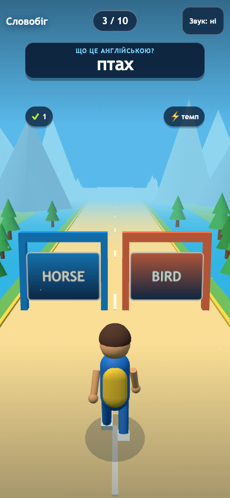

# Word Runner Web Prototype

Public GitHub Pages demo: [https://kiku-jw.github.io/word-runner-web/](https://kiku-jw.github.io/word-runner-web/)

Word Runner is a portrait-first vocabulary runner for a supervised pilot. It is
a static Vite + TypeScript app with a procedural Three.js WebGL scene, native
DOM overlays, a pure scheduling engine, browser speech synthesis when
available, and fully local metrics.

**Validation caveat:** this repository is a `SYNTHETIC DEMO` for UX, playflow,
and local telemetry. It does not prove learning efficacy, retention, payment
intent, or native-app viability.



## What it does

- A real-time 3D runner world with perspective, an animated character, moving
  scenery, depth fog, and two physical answer gates.
- One-tap quick start into the default lesson, plus an optional lesson picker
  and six-card review flow.
- Ukrainian child-facing UI with tap, swipe, and keyboard lane controls.
- Four lessons, six concepts per lesson, 24 total concepts.
- Six-card review before the first run for each lesson.
- Ten-question runs with immediate correction and replay support.
- A usable CSS fallback when WebGL2 is unavailable.
- Parent gate with hold-to-open metrics, JSON export, and local reset.
- Local persistence only. No account, ads, backend, or remote analytics.

## What it does not do

- No backend or cloud sync.
- No remote analytics or advertising.
- No speech-recognition flow.
- No claims that the prototype teaches vocabulary on its own.
- No per-concept licensed image/audio pack in the current build.

## Quick start

```bash
npm install
npm run dev
```

Open the local Vite URL that the command prints.

## Scripts

| Script | Purpose |
| --- | --- |
| `npm run dev` | Start the local Vite dev server. |
| `npm run test` | Run the Vitest unit suite. |
| `npm run build` | Type-check and build the production bundle. |
| `npm run test:e2e` | Run the Playwright browser suite. |
| `npm run check` | Run unit tests and the production build. |
| `npm run qa` | Run the full local QA flow: check + Playwright. |
| `npm run preview` | Serve the production build locally on `127.0.0.1:4173`. |

## Architecture

- `src/engine.ts` owns deterministic run construction, answer resolution, and
  content validation.
- `src/scene3d.ts` owns the isolated Three.js renderer, procedural world,
  character and gate animation, capped pixel ratio, and performance sample.
- `src/main.ts` owns rendering, input handling, feedback timing, parent gate,
  export, reset, and coordination between the DOM and 3D scene.
- `src/storage.ts` keeps all pilot state in `localStorage` under
  `word-runner-pilot-v1`.
- `src/metrics.ts` records only local pilot events and computes the adult
  summary.
- `src/content.ts` defines the four lessons and 24 prototype-reviewed concepts.
- `public/assets/track-carpathians.webp` and `public/assets/runner.webp` remain
  generated original assets for menus and the WebGL fallback. Their provenance
  is documented in `public/assets/ASSETS.md`; the 3D gameplay world itself is
  code-native.

## Content model

The current content pack is `Українська → English` and contains these lessons:

- `Тварини`
- `Їжа й напої`
- `Транспорт`
- `Природа`

Each concept uses:

- a Ukrainian source word;
- an English target word;
- an emoji glyph for the concept card and feedback layer;
- browser speech synthesis for pronunciation when the browser supports it,
  preferring high-quality local Apple, Google, or Microsoft English voices;
- lesson-scoped distractor IDs.

The content is prototype-reviewed, not final educational copy. If a future pack
adds real image or audio assets, that provenance must be reviewed separately.

## Local metrics

The adult metrics screen summarizes only browser-local events:

- `sessions` - distinct local session IDs that opened the prototype.
- `runsStarted` - runs that reached the active gameplay state.
- `runs` - completed runs.
- `answers` - selected answers.
- `laneInputs` - accepted tap, swipe, or keyboard lane selections.
- `correctAnswers` - correct answers within the logged answers.
- `accuracyPercent` - correct answers divided by answers.
- `replays` - replay actions after a finished run.
- `returnSessions` - later sessions that start at least 12 hours after the
  first logged session.
- `averageEnjoyment` - mean child rating from 1 to 5, rounded to one decimal.
- `medianFps` - median of one local renderer sample per run when WebGL is
  active; it is a technical diagnostic, not remote analytics.
- `lastActivityAt` - timestamp of the latest logged event.

The export action writes the current participant ID, concept progress, and full
event log to a JSON file. Reset clears the same local browser state after an
explicit confirmation.

## Privacy boundary

- No account, login, email, or child profile.
- No cookies or remote analytics added by the app.
- No automatic network transmission of gameplay events.
- Input method and a single renderer sample per run stay in the same local
  event log and are exported only by an explicit adult action.
- No names, free-text child responses, or device advertising IDs in the event
  model.
- The prototype continues to work after the initial load even if the network is
  dropped.

## Deployment

GitHub Actions publishes the production build to GitHub Pages from `main`.
The live site should resolve at:

- [https://kiku-jw.github.io/word-runner-web/](https://kiku-jw.github.io/word-runner-web/)

Modern browsers with WebGL2 receive the 3D scene. Browsers without WebGL2 keep
the same questions and controls in the simplified CSS presentation.

## Asset provenance

See [public/assets/ASSETS.md](public/assets/ASSETS.md) for the generated
background and runner provenance notes.
